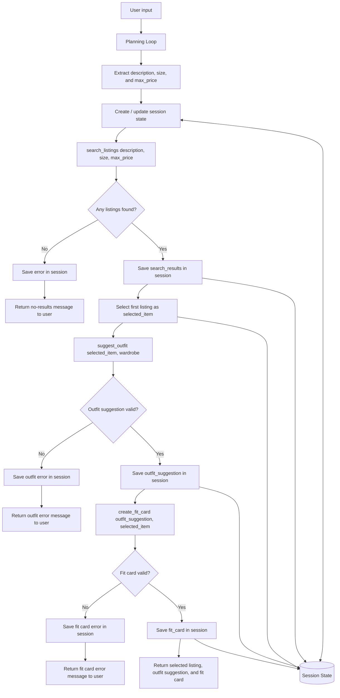

# FitFindr — planning.md

FitFindr is a multi-tool AI agent that helps users shop for secondhand clothes and figure out how to style what they find. The user gives a natural language request like “I want a vintage graphic tee under $30, size M,” and the agent searches the mock listings dataset for matching items.

After the agent finds a listing, it passes that item into an outfit suggestion tool along with the user’s wardrobe. Then it creates a short, shareable “fit card” caption for the completed outfit. If one step fails, the agent should not blindly continue. For example, if no listings are found, the agent should return a helpful message and stop before calling the outfit or fit card tools.
---

## Tools

List every tool your agent will use. For each tool, fill in all four fields.
You must have at least 3 tools. The three required tools are listed — add any additional tools below them.

### Tool 1: search_listings

**What it does:**
<!-- Describe what this tool does in 1–2 sentences -->
This tool searches the mock secondhand listings dataset for items that match the user’s request. It looks at fields such as title, description, category, style tags, brand, size, price, color, condition, and platform.
**Input parameters:**
<!-- List each parameter, its type, and what it represents -->
- description: A string describing what the user wants, such as "vintage graphic tee" or "black leather jacket".
- size: The requested clothing size, such as "M", "L", or "8". This can be None if the user does not mention a size.
- max_price: The maximum price the user is willing to pay. This can be None if the user does not mention a budget.

**What it returns:**
<!-- Describe the return value — what fields does a result contain? -->
The tool returns a list of matching listing dictionaries. Each dictionary may include:

{
    "id": "listing id",
    "title": "item title",
    "description": "item description",
    "category": "item category",
    "style_tags": ["tag1", "tag2"],
    "size": "M",
    "condition": "Good",
    "price": 22.0,
    "colors": ["black", "white"],
    "brand": "brand name",
    "platform": "Depop"
}

**What happens if it fails or returns nothing:**
<!-- What should the agent do if no listings match? -->
If matches are found, the agent stores the list in session state as:

session["search_results"] = results
session["selected_item"] = results[0]

The first result becomes the item passed into suggest_outfit.

If no listings are found, the tool returns an empty list. 

The agent should not call suggest_outfit or create_fit_card. Instead, it should set an error message:

session["error"] = "I couldn't find any matching listings. Try a broader description, a higher budget, or a different size."

Then the agent returns early.
---

### Tool 2: suggest_outfit

**What it does:**
<!-- Describe what this tool does in 1–2 sentences -->
This tool suggests one or more complete outfit ideas using the item selected from the search results and the user’s wardrobe. It should explain how the new thrifted item can be worn with clothing the user already owns.

**Input parameters:**
<!-- List each parameter, its type, and what it represents -->
- new_item: A dictionary representing the selected listing from search_listings. Example:
{ 
     "title": "Faded Band Tee", 
     "price": 22.0, "size": "M", 
     "condition": "Good", 
     "style_tags": ["vintage", "grunge"], 
     "platform": "eBay" }
- wardrobe: A dictionary containing the user’s wardrobe. It should include an "items" list with clothing items the user already owns. Example:
{
    "items": [
        {
            "name": "baggy jeans",
            "category": "bottoms",
            "colors": ["blue"],
            "style_tags": ["streetwear", "casual"]
        },
        {
            "name": "chunky sneakers",
            "category": "shoes",
            "colors": ["white"],
            "style_tags": ["streetwear"]
        }
    ]
}

**What it returns:**
<!-- Describe the return value -->
The tool returns a string containing a styling suggestion. The suggestion should include:

- A top, bottom, and shoe combination when possible.
- A short explanation of why the pieces work together.
- Styling details such as tucking, layering, color matching, or accessories.

**What happens if it fails or returns nothing:**
<!-- What should the agent do if the wardrobe is empty or no outfit can be suggested? -->
If the wardrobe has useful items, the agent stores the result as:

session["outfit_suggestion"] = outfit

Then the outfit suggestion is passed into create_fit_card.

Failure / Edge Case

If the wardrobe is empty or minimal, the tool should still return a useful suggestion. It should not crash or return nothing.

Instead of relying on wardrobe items, it should give general styling advice based on the selected item.

Example empty wardrobe response:

Since you do not have many wardrobe items listed yet, I would style this item with relaxed denim, simple sneakers, and one accessory that matches the color or vibe of the piece.

If new_item is missing or empty, the tool should return:

I need a selected item before I can suggest an outfit.
---

### Tool 3: create_fit_card

**What it does:**
<!-- Describe what this tool does in 1–2 sentences -->
This tool creates a short, shareable outfit caption based on the selected thrifted item and the outfit suggestion. The caption should sound like something someone might post on Instagram, TikTok, or a thrift haul post.

**Input parameters:**
<!-- List each parameter, its type, and what it represents -->
- outfit: The outfit suggestion generated by suggest_outfit.
- new_item: The selected listing from search_listings.

**What it returns:**
<!-- Describe the return value -->
The tool returns a short string. It should be casual, stylish, and specific to the item.

Example return value:

thrifted this faded band tee for $22 and it instantly became the main character of my baggy denim rotation 🖤 easy 90s streetwear fit, no overthinking needed

**What happens if it fails or returns nothing:**
<!-- What should the agent do if the outfit data is incomplete? -->
The agent stores the fit card as:

session["fit_card"] = fit_card

The final response to the user includes:

The selected listing.
The outfit suggestion.
The fit card caption.

If the outfit string is empty, the tool should not call the LLM. It should return:

I need an outfit suggestion before I can create a fit card.

If new_item is missing, the tool should return:

I need a selected item before I can create a fit card.
---

### Additional Tools (if any)

<!-- Copy the block above for any tools beyond the required three -->

---

## Planning Loop

**How does your agent decide which tool to call next?**
<!-- Describe the logic your planning loop uses. What does it look at? What conditions change its behavior? How does it know when it's done? -->
The agent will use a conditional planning loop instead of calling every tool automatically no matter what happens.

The loop starts with the user query. First, the agent extracts three pieces of information from the query:

description
size
max_price

For example:

User query: "I'm looking for a vintage graphic tee under $30, size M. I mostly wear baggy jeans and chunky sneakers."

The extracted values are:

description = "vintage graphic tee"
size = "M"
max_price = 30.0

The agent then creates a session dictionary to track state:

session = {
    "query": user_query,
    "description": description,
    "size": size,
    "max_price": max_price,
    "search_results": None,
    "selected_item": None,
    "outfit_suggestion": None,
    "fit_card": None,
    "error": None
}
Step-by-step planning logic
Start with the user’s query.
Extract description, size, and max_price.
Call search_listings(description, size, max_price).
Store the result in session["search_results"].
Check whether the search results are empty.
If the results are empty:
Set session["error"].
Return the session immediately.
Do not call suggest_outfit.
Do not call create_fit_card.
If the results are not empty:
Select the first result.
Store it in session["selected_item"].
Call suggest_outfit(session["selected_item"], wardrobe).
Store the result in session["outfit_suggestion"].
Check whether the outfit suggestion is empty or invalid.
If the outfit suggestion failed:
Set session["error"].
Return the session.
If the outfit suggestion worked:
Call create_fit_card(session["outfit_suggestion"], session["selected_item"]).
Store the result in session["fit_card"].
Return the completed session.

This loop is conditional because the agent’s next action depends on what happened in the previous step. If the listing search fails, the agent stops early. If it succeeds, the selected item becomes state that the next tools use.
---

## State Management

**How does information from one tool get passed to the next?**
<!-- Describe how your agent stores and accesses state within a session. What data is tracked? How is it passed between tool calls? -->
The agent will use one session dictionary to track all important information during a single interaction.

The main state fields are:

session = {
    "query": user_query,
    "description": description,
    "size": size,
    "max_price": max_price,
    "search_results": results,
    "selected_item": selected_item,
    "outfit_suggestion": outfit,
    "fit_card": fit_card,
    "error": error_message
}

The most important state transfer is:

search_listings result → selected_item → suggest_outfit → outfit_suggestion → create_fit_card

This means the user does not need to repeat information. Once the agent finds an item, that item is passed automatically into the next tool.
---

## Error Handling

For each tool, describe the specific failure mode you're handling and what the agent does in response.

| Tool | Failure mode | Agent response |
|------|-------------|----------------|
| `search_listings` | No listings match the description, size, and price | Return an empty list. The agent tells the user: “I couldn't find any matching listings. Try a broader description, a higher budget, or a different size.” |
| `search_listings` | User does not provide size                         | Search without a size filter.                                                                                                                             |
| `search_listings` | User does not provide max price                    | Search without a price filter.                                                                                                                            |
| `suggest_outfit`  | Wardrobe is empty                                  | Give general styling advice instead of crashing.                                                                                                          |
| `suggest_outfit`  | `new_item` is missing                              | Return: “I need a selected item before I can suggest an outfit.”                                                                                          |
| `create_fit_card` | Outfit suggestion is empty                         | Return: “I need an outfit suggestion before I can create a fit card.”                                                                                     |
| `create_fit_card` | Selected item is missing                           | Return: “I need a selected item before I can create a fit card.”                                                                                          |
| Planning loop     | Search fails                                       | Stop early and return the error message. Do not call the later tools.                                                                                     |

---

## Architecture

<!-- Draw a diagram of your agent showing how the components connect:
     User input → Planning Loop → Tools (search_listings, suggest_outfit, create_fit_card)
                                                                          ↕
                                                                   State / Session
     Show what triggers each tool, how state flows between them, and where error paths branch off.
     ASCII art, a Mermaid diagram (https://mermaid.js.org/syntax/flowchart.html), or an embedded
     sketch are all fine. You'll share this diagram with an AI tool when asking it to implement
     the planning loop and each individual tool. -->

---

## AI Tool Plan

<!-- For each part of the implementation below, describe:
     - Which AI tool you plan to use (Claude, Copilot, ChatGPT, etc.)
     - What you'll give it as input (which sections of this planning.md, your agent diagram)
     - What you expect it to produce
     - How you'll verify the output matches your spec before moving on

     "I'll use AI to help me code" is not a plan.
     "I'll give Claude my Tool 1 spec (inputs, return value, failure mode) and ask it to implement
     search_listings() using load_listings() from the data loader — then test it against 3 queries
     before trusting it" is a plan. -->

**Milestone 3 — Individual tool implementations:**
I plan to use ChatGPT or GitHub Copilot to help implement each required tool one at a time. I will not ask the AI tool to build the whole project at once. Instead, I will give it the specific tool description from this planning document and ask for one function at a time.

For search_listings, I will give the AI tool the Tool 1 section of this document. I will ask it to implement search_listings(description, size, max_price) using the provided mock listings data and load_listings(). I expect it to produce a function that filters listings by item description, optional size, and optional max price. I will verify the output by testing at least three searches: one that should return results, one that should return no results, and one that checks the price filter.

For suggest_outfit, I will give the AI tool the Tool 2 section. I will ask it to implement a function that accepts a selected item and a wardrobe dictionary, then returns a styling suggestion as a string. I will verify it by testing it with a normal wardrobe and an empty wardrobe.

For create_fit_card, I will give the AI tool the Tool 3 section. I will ask it to implement a function that turns the outfit suggestion and selected item into a short caption. I will verify that it returns a caption when valid inputs are provided and returns a helpful message when the outfit input is missing.
**Milestone 4 — Planning loop and state management:**
I plan to use ChatGPT or GitHub Copilot to help implement the planning loop after the individual tools are working. I will give the AI tool the Planning Loop, State Management, Error Handling, and Architecture sections of this document.

I expect it to produce a run_agent() function that:

Creates a session dictionary.
Extracts the description, size, and max price from the user query.
Calls search_listings.
Stops early if no listings are found.
Saves the first listing as selected_item.
Calls suggest_outfit.
Calls create_fit_card.
Returns the completed session.

I will verify the planning loop by running one successful query and one failure query. The successful query should produce a listing, outfit suggestion, and fit card. The failure query should stop after search_listings and should not call the later tools.
---

## A Complete Interaction (Step by Step)

Write out what a full user interaction looks like from start to finish — tool call by tool call. Use a specific example query.

**Example user query:** "I'm looking for a vintage graphic tee under $30. I mostly wear baggy jeans and chunky sneakers. What's out there and how would I style it?"

**Step 1:**
<!-- What does the agent do first? Which tool is called? With what input? -->
The agent reads the user query and extracts the main shopping constraints:

description = "vintage graphic tee"
size = None
max_price = 30.0

The agent also notes wardrobe information from the query:

wardrobe = {
    "items": [
        "baggy jeans",
        "chunky sneakers"
    ]
}

Then the agent calls:

search_listings("vintage graphic tee", size=None, max_price=30.0)
**Step 2:**
<!-- What happens next? What was returned from step 1? What tool is called now? -->
search_listings returns a list of matching listings. For example:

[
    {
        "title": "Vintage Graphic Tee",
        "description": "Faded oversized tee with retro print",
        "category": "tops",
        "size": "M",
        "price": 24.00,
        "condition": "Good",
        "platform": "Depop",
        "style_tags": ["vintage", "streetwear", "casual"]
    }
]

The agent stores this result:

session["search_results"] = results
session["selected_item"] = results[0]

Next, the agent calls:

suggest_outfit(session["selected_item"], wardrobe)
**Step 3:**
<!-- Continue until the full interaction is complete -->
suggest_outfit returns a styling suggestion:

Pair the vintage graphic tee with your baggy jeans and chunky sneakers for a relaxed streetwear look. The oversized shape of the tee works well with loose denim, and the sneakers keep the outfit casual and balanced.

The agent stores this:

session["outfit_suggestion"] = outfit

Then the agent calls:

create_fit_card(session["outfit_suggestion"], session["selected_item"])
**Step 4**
create_fit_card returns a short caption:

Thrifted this vintage graphic tee for $24 and styled it with baggy jeans + chunky sneakers for an easy streetwear fit. Casual, comfy, and very 90s.

The agent stores this:

session["fit_card"] = fit_card
**Final output to user:**
<!-- What does the user actually see at the end? -->
I found this listing: Vintage Graphic Tee Price: $24 Size: M Condition: Good Platform: Depop Outfit suggestion: Pair the vintage graphic tee with your baggy jeans and chunky sneakers for a relaxed streetwear look. The oversized shape of the tee works well with loose denim, and the sneakers keep the outfit casual and balanced. Fit card: Thrifted this vintage graphic tee for $24 and styled it with baggy jeans + chunky sneakers for an easy streetwear fit. Casual, comfy, and very 90s.

